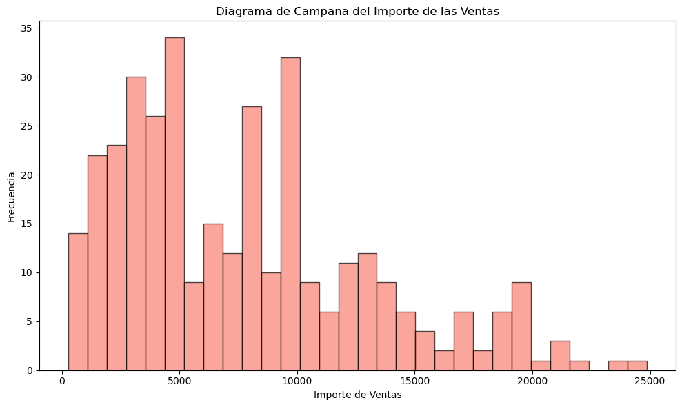
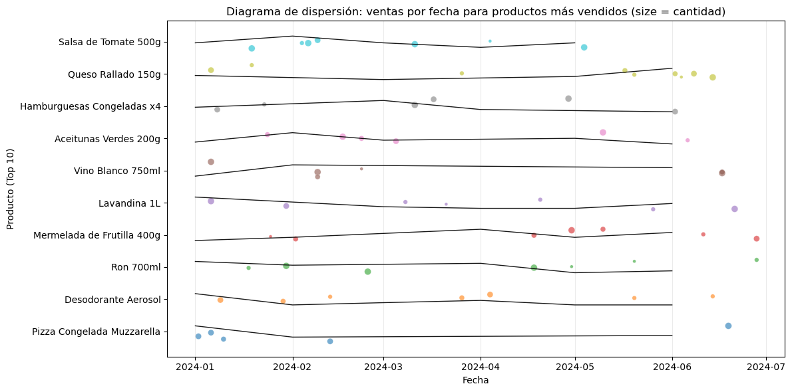
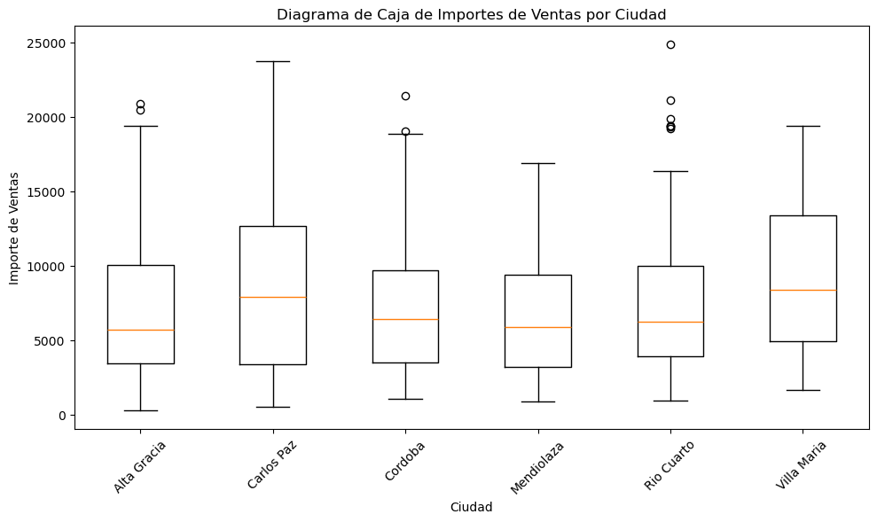
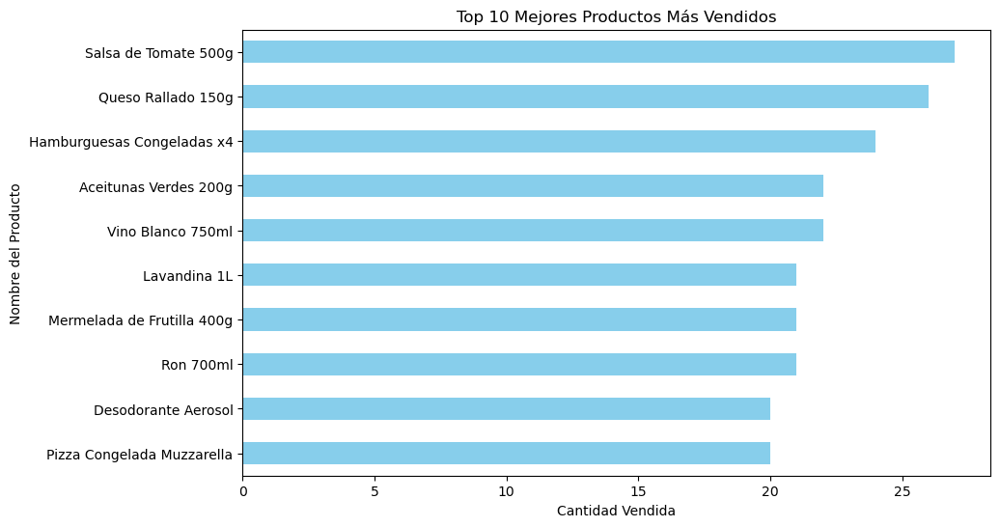
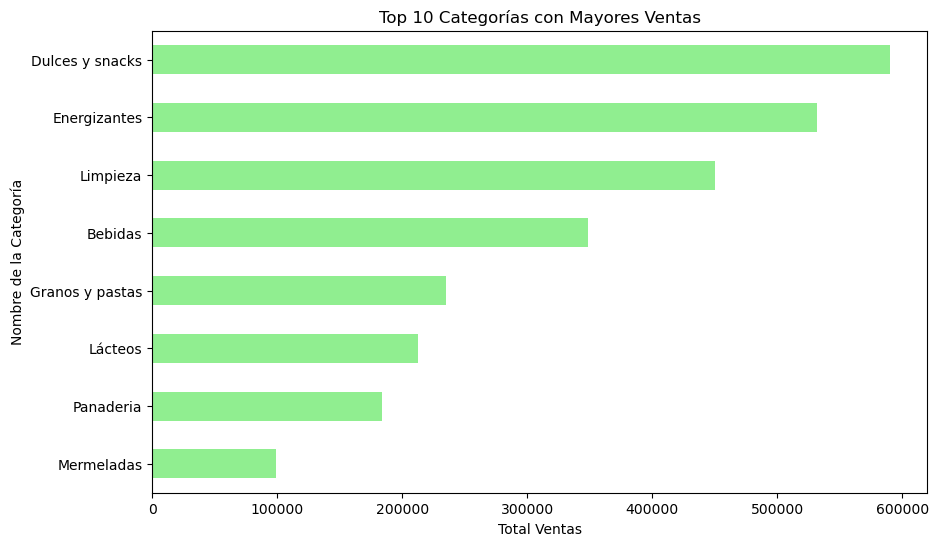
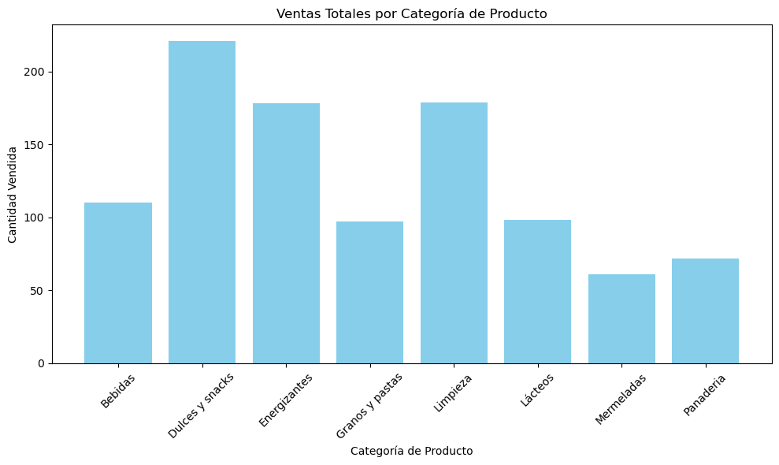

### Base de datos limpia
A partir de la base de datos otorgada, se realizó la limpieza y una mejor estructura: 
- **Tabla Cliente**
    Completamente correcta, sin datos duplicados.
- **Tabla Producto**
    A partir de la columna categoria se realizo una nueva tabla llamada ```Categoria``` con las columnas: ```id_categoria``` y ```nombre_categoria```, a continuación se realizó la conexión con la tabla Producto a partir del id_categoria
- **Tabla Ventas**
    Se eliminaron las columnas ```nombre_cliente```, ```email``` y ```medio_pago```. La columna```medio pago``` paso a ser una nueva tabla, en la cual contiene ```id_medio_pago``` y ```nombre_medio_pago```.
- **Tabla Detalles_ventas**
    Se eliminaron las columnas ```nombre_producto``` y  ```precio_unitario```.

Las tablas con las que nos quedamos son: ```Cliente```, ```Producto```, ```Ventas```, ```Detalles_ventas```, ```Categoria``` y ```Metodo_Pago```.

### Estadísticas descriptivas básicas
Estadísticas descriptivas del importe de las ventas:
| Estadística | Resultado 
|-----------|----------|
|**count:** | 343.00   |
|**mean:**  | 7730.08  |
|**std:**   | 5265.54  |
|**min:**   | 272.00   |
|**25%:**   | 3489.00  |
|**50%:**   | 6702.00  |
|**75%:**   | 10231.50 |
|**max:**   | 24865.00 |

---

### Tipo de distribución de la variable
Analizando el importe de las ventas por productos como se muestra en el siguiente Histograma, podemos notar que tiene una distribución sesgada a la derecha. Esto refleja como las ventas de bajo valor dominan, lo cual genera un importe relativamente bajo por transacción. Analizando nuestro problema, podemos notar como los productos estancados no se reflejan en el pico, por lo cual absorben capital. Los picos del lado izquierdo son de alta demanda y volumen.



---

### Análisis de correlaciones entre variables principales
Dentro del siguiente diagrama, se realizo una correlación de acuerdo a cada producto que se vende por fechas, específicamente cada mes y las cantidades vendidas se ven representadas por medio de circulos entre más grande mayor es la cantidad que se han vendido. 


---

### Detección de outliers
Se realizo un diagrama de cajas para representar las mayores ventas que se tiene por ciudad, para identificar los outliers. Dentro del mismo diagrama se muestra que en Alta Gracia, Cordoba y Rio Cuarto, presentan valores atípicos, lo cual puede distorsionar los resultados de un análisis. 


---

### Gráficos representativos
#### Top 10 mejores productos más vendidos


#### Top 10 categorias con mayores ventas


#### Ventas totales por categoria de productos

---

### Interpretación de los resultados
Luego de realizar un análisis de los gráficos y de la base de datos que hemos creado y usado, podemos sacar las siguiente conclusiones:
- Las ventas dentro de la tienda depende únicamente de los productos con menor precio, lo cual genera un estancamiento en el inventario de los productos menos vendidos y con mayores precios. 
- Usando el diagrama de cajas, podemos notar que en cada ciudad las ventas son variadas, a pesar de los valores atípicos que reflejan errores, podemos afirmar que no necesariamente se requiere hacer un abastecimiento del inventario en cada tienda, sino que depende de los productos que más rotación tiene.
- Con el diagrama de correlación podemos identificar que productos se venden con más frecuencia durante los meses, por ejemplo para las celebraciones o fiestas tradicionales, de esta manera podemos identificar y predecir que productos serán más vendidos y realizar un abastecimiento del inventario seguro. 
- Cosas que se pueden mejorar:
    - Se puede agregar más productos y más filas en las tablas para lograr mejores resultados
    - Identificar en más detalle la correlación que existe con las demás variables, para una óptima solución. 
